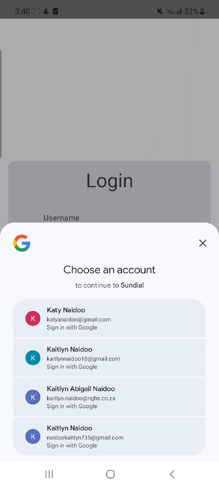
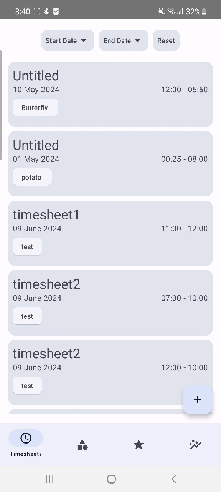

# Timesheet Tracker
This is a timesheet tracker app built using Jetpack Compose for OPSC7311.
An APK is provided for you to run the app on your device in `app-debug.apk`.

# Group Details
```
Kaitlyn Naidoo ST10083262@vcconnect.edu.za
```

To Login press the login button and sign in using a Google Account.

# Features
- Track your timesheets
- Filter your timesheets by a date range
- Clean UI
- Sort your timesheets with categories and filter those too!

# Screenshots



# Getting Started
To get started with this project, follow these steps:

- Clone this repository
- Open the project in Android Studio
- Build and run the project on an emulator or physical device

# Unique Features
- Instant Dark Mode switch using the toggle theme mode on your phone.
- Google Sign-in using firebase authentication. You can now save your
  progress easily across all your devices by using your google account.


# Dependencies
This project uses the following dependencies:
- Jetpack Compose UI Toolkit
- ViewModel and LiveData
- Material Design Components
- Firebase
